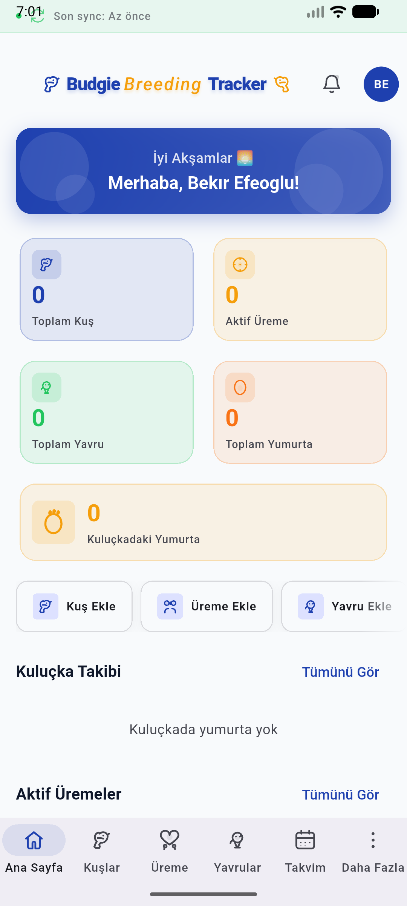
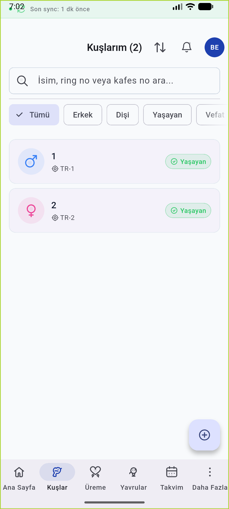
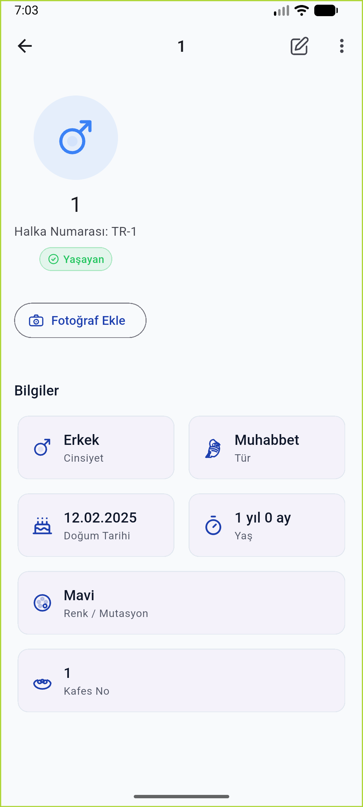
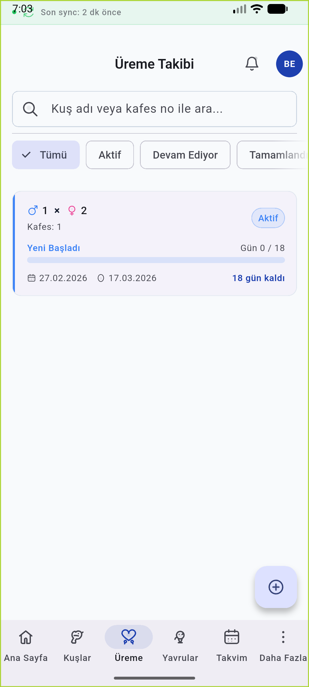
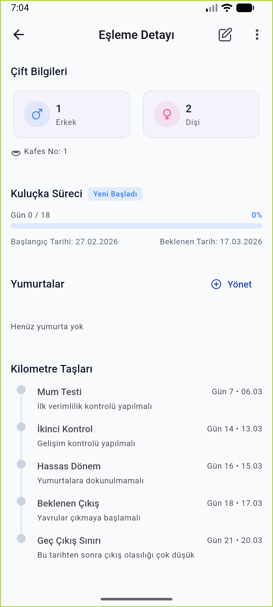
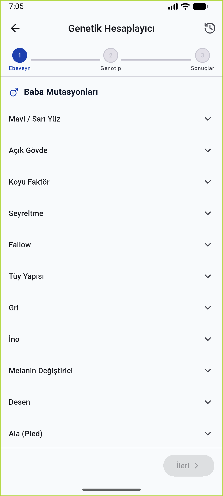
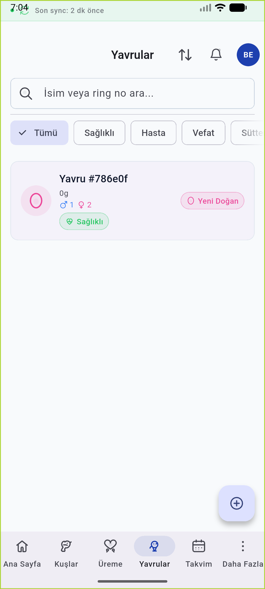
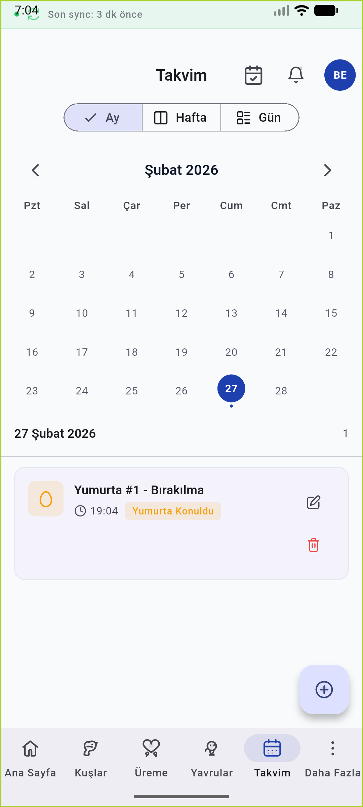
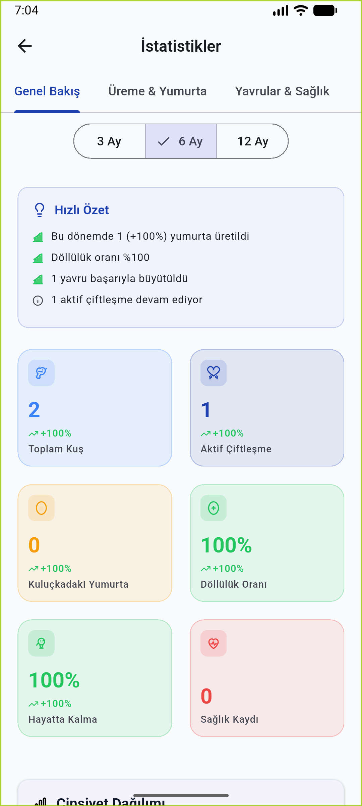
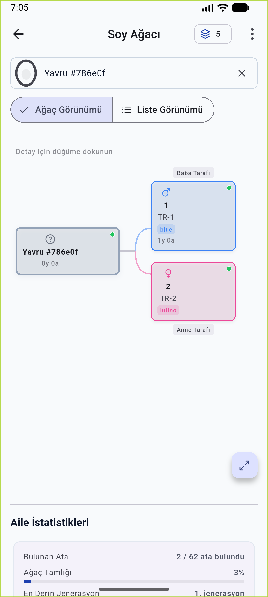

<p align="center">
  
</p>

<h1 align="center">BudgieBreedingTracker</h1>

<p align="center">
  Offline-first breeding management app for budgerigar breeders.
</p>

<p align="center">
  Bird records, pairing, incubation, chick growth, genetics, pedigree, reminders, backups, and cloud sync in one workflow.
</p>

<p align="center">
  <a href="https://budgiebreedingtracker.online"></a>
  <a href="https://github.com/BekirEfeoglu/BudgieBreedingTracker/actions/workflows/ci.yml"></a>
  <a href="https://codecov.io/gh/BekirEfeoglu/BudgieBreedingTracker"></a>
</p>

<p align="center">
  
  
  
  
  
  
</p>

<p align="center">
  <a href="#overview">Overview</a>
  ·
  <a href="#feature-set">Feature Set</a>
  ·
  <a href="#screenshots">Screenshots</a>
  ·
  <a href="#tech-stack">Tech Stack</a>
  ·
  <a href="#getting-started">Getting Started</a>
  ·
  <a href="#project-structure">Project Structure</a>
</p>

---

## Overview

BudgieBreedingTracker is a production Flutter application built for breeders who need a reliable system for managing birds, breeding pairs, eggs, chicks, and long-term breeding history. The app is designed around a local-first workflow: data is stored in SQLite through Drift, then synchronized with Supabase when credentials and connectivity are available.

The repository includes the main mobile app, localized content in Turkish, English, and German, CI workflows, website assets, and promotional material used around the product.

## Feature Set

### Breeding workflow

- Bird registry with mutation, color, ring number, photos, notes, and status tracking
- Pair management for breeding setup, clutch history, and nesting progress
- Egg and incubation monitoring with hatch timing, milestones, and reminders
- Chick management with growth measurements and development history
- Health record tracking for treatments, observations, and follow-ups

### Genetics and analysis

- Punnett square based genetics calculator
- Genotype helpers and reverse calculation tools
- Pedigree and family tree views for lineage tracking
- Statistics and breeding performance dashboards
- Calendar-driven planning for breeding and care events

### Operations and platform

- Offline-first architecture backed by Drift and SQLite
- Supabase integration for auth, storage, and sync workflows
- Local notifications for incubation and event reminders
- Export and backup flows using PDF and Excel generation
- Premium and admin modules for gated features and operational controls
- Sentry integration for crash reporting and runtime monitoring
- Multi-language UI: Turkish, English, and German

## Screenshots

<p align="center">
  
  
  
  
  
</p>

<p align="center">
  
  
  
  
  
</p>

<p align="center">
  Product site: <a href="https://budgiebreedingtracker.online">budgiebreedingtracker.online</a>
</p>

## Tech Stack

| Area | Tools |
| --- | --- |
| App framework | Flutter, Dart |
| State management | Riverpod |
| Navigation | GoRouter |
| Data models | Freezed, json_serializable |
| Local storage | Drift, SQLite |
| Backend | Supabase |
| Localization | easy_localization |
| Notifications | flutter_local_notifications, timezone |
| Reporting | pdf, excel, share_plus |
| Monitoring | sentry_flutter |
| Payments | purchases_flutter |

## Getting Started

### Requirements

| Requirement | Notes |
| --- | --- |
| Flutter SDK | Stable channel |
| Dart SDK | `>=3.8.0 <4.0.0` |
| Android Studio / Xcode / VS Code | Any standard Flutter setup |
| Supabase project | Required for auth, sync, and storage features |

### Setup

```bash
git clone https://github.com/BekirEfeoglu/BudgieBreedingTracker.git
cd BudgieBreedingTracker

flutter pub get
dart run build_runner build --delete-conflicting-outputs

cp .env.example .env
flutter run --dart-define-from-file=.env
```

If your local Flutter version does not support `--dart-define-from-file`, pass the values explicitly:

```bash
flutter run \
  --dart-define=SUPABASE_URL=https://your-project.supabase.co \
  --dart-define=SUPABASE_ANON_KEY=your-anon-key \
  --dart-define=SENTRY_DSN=your-sentry-dsn \
  --dart-define=SENTRY_ENVIRONMENT=development \
  --dart-define=REVENUECAT_API_KEY_IOS=your-ios-key \
  --dart-define=REVENUECAT_API_KEY_ANDROID=your-android-key
```

### Environment Variables

| Variable | Required | Description |
| --- | --- | --- |
| `SUPABASE_URL` | Yes for cloud features | Supabase project URL |
| `SUPABASE_ANON_KEY` | Yes for cloud features | Supabase anon key |
| `SENTRY_DSN` | No | Sentry DSN |
| `SENTRY_ENVIRONMENT` | No | Sentry environment label |
| `REVENUECAT_API_KEY_IOS` | No | RevenueCat iOS API key |
| `REVENUECAT_API_KEY_ANDROID` | No | RevenueCat Android API key |

The app can still boot without Supabase credentials, but authentication, sync, and other cloud-backed flows will be unavailable.

### Common Commands

| Command | Purpose |
| --- | --- |
| `flutter pub get` | Install dependencies |
| `dart run build_runner build --delete-conflicting-outputs` | Generate code |
| `dart run build_runner watch --delete-conflicting-outputs` | Watch and regenerate files |
| `flutter analyze --no-fatal-infos` | Static analysis |
| `flutter test --exclude-tags "golden || e2e"` | Fast local test run |
| `flutter test test/golden --tags golden` | Golden tests |
| `python scripts/check_l10n_sync.py` | Verify translation key parity |
| `python scripts/verify_code_quality.py` | Run project rule scan |

## Architecture Notes

- The app follows a feature-first structure under `lib/features/`.
- Shared foundations live in `lib/core/`.
- Local and remote data access live in `lib/data/`.
- Cross-feature services such as sync, genetics, backup, export, notifications, and payments live in `lib/domain/services/`.
- Navigation, guards, and route definitions live in `lib/router/`.
- The main data flow is local-first: write to SQLite, mark for sync, then reconcile with Supabase when available.

## Project Structure

```text
BudgieBreedingTracker/
├── assets/                 # Images, icons, translations, fonts
├── docs/                   # Website files, privacy policy, screenshots
├── lib/
│   ├── core/               # Shared constants, theme, utilities, widgets
│   ├── data/               # Drift DB, Supabase sources, repositories, models
│   ├── domain/services/    # Sync, genetics, export, backup, notifications
│   ├── features/           # Admin, auth, birds, breeding, chicks, etc.
│   └── router/             # Route definitions and guards
├── scripts/                # Localization and code quality helpers
├── test/                   # Widget, unit, golden, and end-to-end tests
├── promo-video/            # Promo video assets
└── remotion-promo/         # Remotion-based promo project
```

## Quality and Delivery

GitHub Actions is configured for:

- static analysis
- automated tests with coverage upload
- golden test verification
- localization sync checks
- code quality scanning
- Android debug builds
- iOS no-codesign builds

See [`.github/workflows/ci.yml`](.github/workflows/ci.yml) for the current pipeline.

## Contributing

Contributions should follow the repository conventions for architecture, localization, and commit format.

- Contribution guide: [`CONTRIBUTING.md`](CONTRIBUTING.md)
- Security policy: [`SECURITY.md`](SECURITY.md)
- Privacy policy: [`docs/privacy-policy.html`](docs/privacy-policy.html)

## License

This repository is distributed under a proprietary license. See [`LICENSE`](LICENSE) for usage terms and contact details.
