<p align="center">
  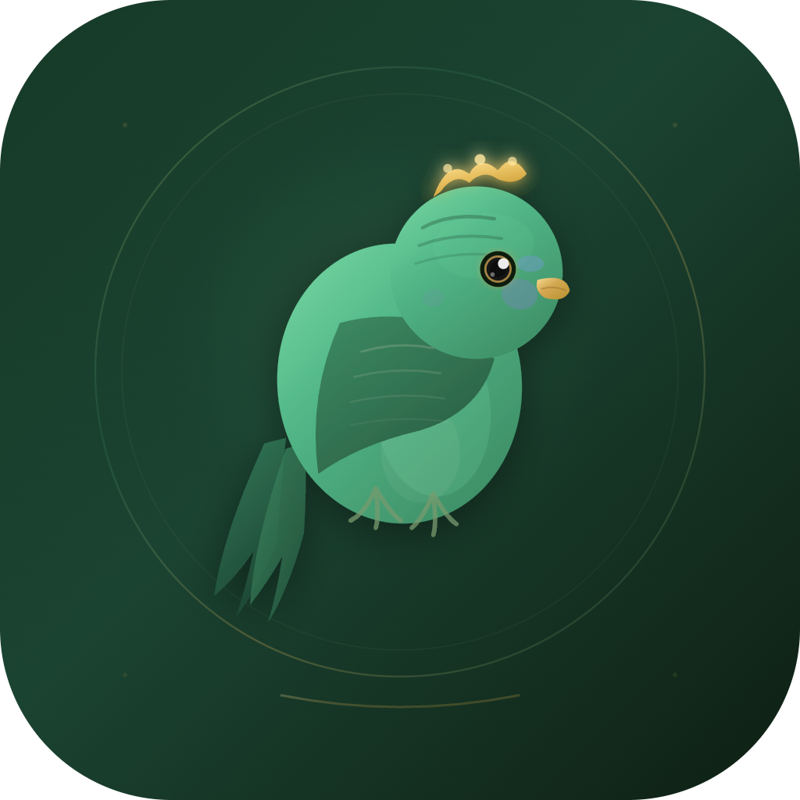
</p>

<h1 align="center">BudgieBreedingTracker</h1>

<p align="center">
  Offline-first breeding management app for budgerigar breeders.
</p>

<p align="center">
  Bird records, pairing, incubation, chick growth, genetics, pedigree, community, reminders, backups, and cloud sync in one workflow.
</p>

<p align="center">
  <a href="https://budgiebreedingtracker.online"></a>
  <a href="https://www.facebook.com/BudgieBreedingTracker/"></a>
  <a href="https://www.instagram.com/budgiebreedingtrackerr/"></a>
  <a href="https://github.com/BekirEfeoglu/BudgieBreedingTracker/actions/workflows/ci.yml"></a>
  <a href="https://codecov.io/gh/BekirEfeoglu/BudgieBreedingTracker"></a>
</p>

<p align="center">
  
  
  
  
  
  
</p>

<p align="center">
  <a href="#overview">Overview</a>
  &middot;
  <a href="#feature-set">Feature Set</a>
  &middot;
  <a href="#screenshots">Screenshots</a>
  &middot;
  <a href="#tech-stack">Tech Stack</a>
  &middot;
  <a href="#architecture">Architecture</a>
  &middot;
  <a href="#getting-started">Getting Started</a>
</p>

---

## Overview

BudgieBreedingTracker is a production Flutter application built for breeders who need a reliable system for managing birds, breeding pairs, eggs, chicks, and long-term breeding history. The app is designed around a local-first workflow: data is stored in SQLite through Drift, then synchronized with Supabase when credentials and connectivity are available.

The repository includes the main mobile app, localized content in Turkish, English, and German, CI workflows, website assets, and promotional material used around the product.

### Project at a Glance

| Metric | Value |
| --- | --- |
| Source files | 808 Dart files |
| Test suite | 8,930+ tests (unit, widget, golden, e2e) |
| Feature modules | 23 |
| Drift tables | 20 |
| Routes | 70 |
| Custom SVG icons | 84 |
| Localization keys | ~2,243 per language (TR, EN, DE) |
| Domain services | 15 |
| DB schema version | 19 |

## Feature Set

### Breeding workflow

- Bird registry with mutation, color, ring number, photos, notes, and status tracking
- Pair management for breeding setup, clutch history, and nesting progress
- Egg and incubation monitoring with hatch timing, milestones, and environment tracking
- Chick management with growth measurements, development stages, and weaning alerts
- Health record tracking for treatments, observations, and follow-ups
- Nest management and breeding calendar integration

### Genetics and analysis

- Punnett square based genetics calculator with epistasis engine
- Genotype helpers, reverse calculation, and color audit tools
- Dihybrid cross support and Z-linked inheritance modeling
- Inbreeding coefficient calculation and lethal combination warnings
- Pedigree and family tree views with configurable depth
- Statistics dashboards with breeding success, fertility trends, and egg production charts
- Calendar-driven planning for breeding and care events

### Community and Social

- Social feed with posts, photos, and multi-media galleries
- Comment system with nested replies
- Bookmarks, search, and user profile pages
- Following system and user discovery
- Direct messaging and group conversations
- Content moderation with automated image safety checks

### Marketplace

- Bird listing and browsing for buying/selling
- Detailed listing pages with photos and pricing

### Gamification

- Achievement badges and milestone tracking
- Leaderboard system for community engagement

### Operations and platform

- Offline-first architecture backed by Drift (SQLite) with background cloud sync
- Supabase integration for auth (email, OAuth, 2FA), storage, and edge functions
- Local notifications with rate limiting and do-not-disturb scheduling
- Export and backup flows using PDF and Excel generation with AES-256 encryption
- Premium subscription management via RevenueCat
- Admin panel with user management, audit logs, security monitoring, and system metrics
- Sentry integration for crash reporting and performance monitoring
- Multi-language UI: Turkish, English, and German

## Screenshots

<p align="center">
  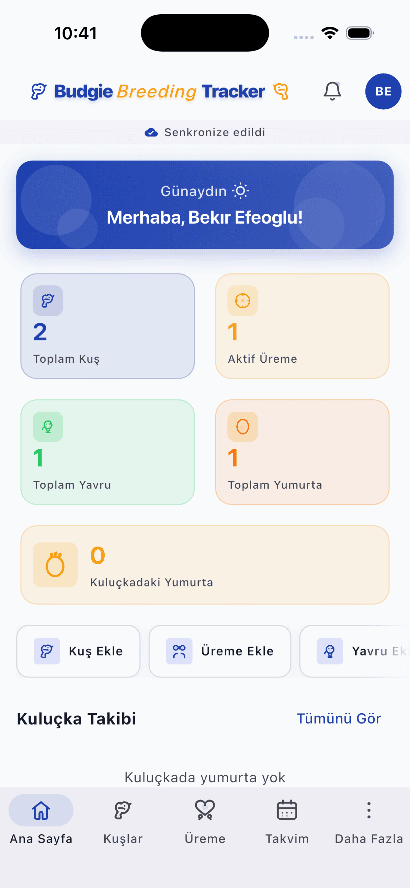
  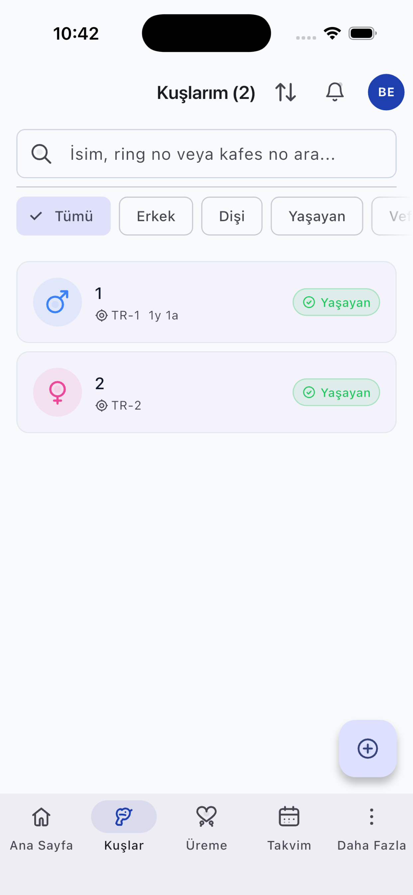
  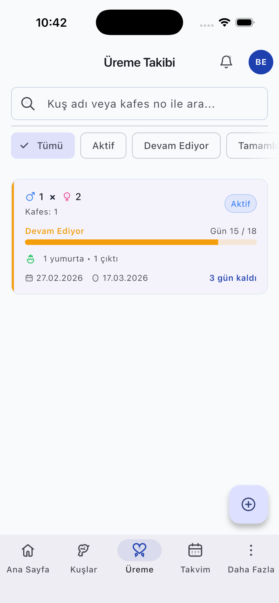
  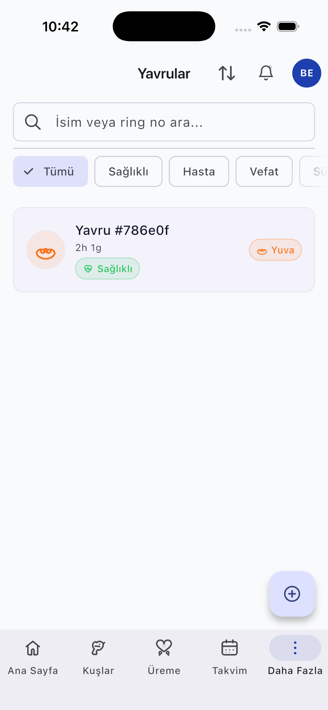
  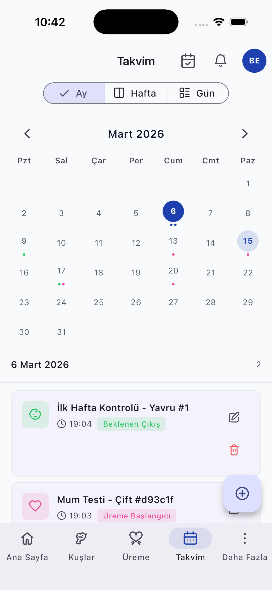
</p>

<p align="center">
  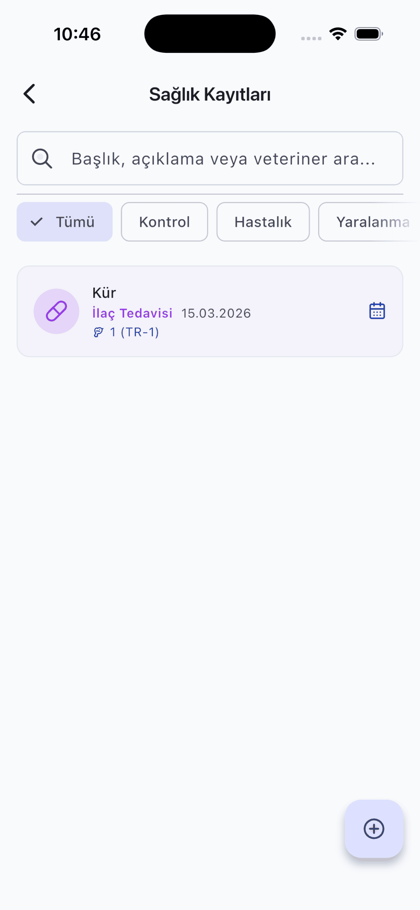
  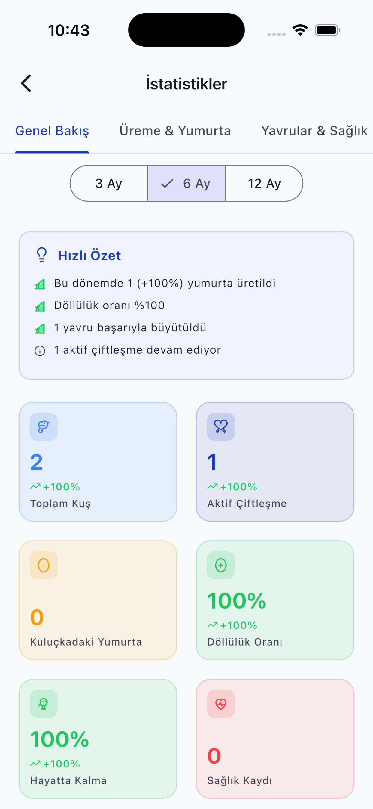
  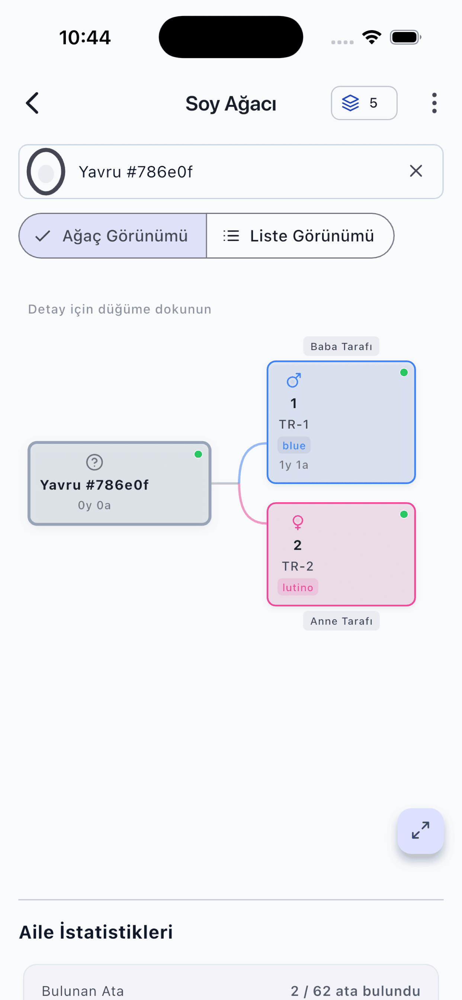
  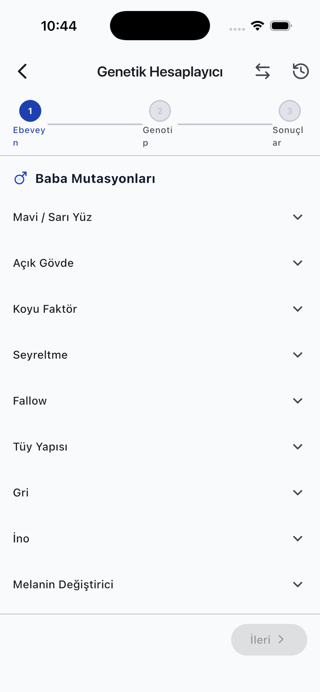
  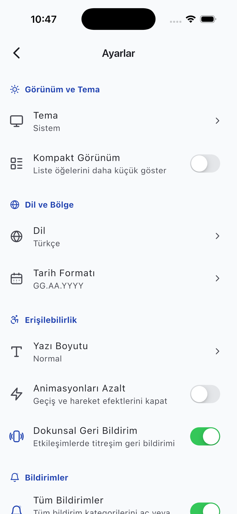
</p>

<p align="center">
  Product site: <a href="https://budgiebreedingtracker.online">budgiebreedingtracker.online</a>
</p>

## Tech Stack

| Area | Tools |
| --- | --- |
| App framework | Flutter 3.16+, Dart 3.8+ |
| State management | Riverpod 3 (code generation) |
| Navigation | GoRouter 17+ |
| Data models | Freezed 3, json_serializable |
| Local storage | Drift 2.31+, SQLite |
| Backend | Supabase (PostgreSQL, Auth, Storage, Edge Functions) |
| Localization | easy_localization (TR, EN, DE) |
| Icons | 84 custom SVGs (flutter_svg) + Lucide Icons |
| Charts | fl_chart |
| Notifications | flutter_local_notifications, timezone |
| Reporting | pdf, excel, share_plus |
| Encryption | encrypt (AES-256-CBC) |
| Payments | purchases_flutter (RevenueCat) |
| Monitoring | sentry_flutter |

## Architecture

### Data Flow

```
UI (ConsumerWidget)
  → ref.watch(provider)
    → Repository
      → DAO (Drift/SQLite)        ← local-first writes
      → RemoteSource (Supabase)   ← background sync
```

All writes go to local SQLite first. A background sync orchestrator pushes pending changes to Supabase and pulls remote updates using server-wins conflict resolution.

### Layer Hierarchy

```
core/       → Shared constants, theme, utilities, widgets (no feature imports)
data/       → Models, Drift tables/DAOs/mappers, Supabase sources, repositories
domain/     → Business services (genetics, sync, backup, export, notifications)
features/   → 23 self-contained modules (providers + screens + widgets)
router/     → GoRouter config (70 routes), auth/admin/premium guards
```

Import rules are enforced: `core/` never imports from `data/` or `features/`, `data/` never imports from `features/`.

### Sync Architecture

- Push order follows FK dependencies across 8 layers (Profile → Birds → Pairs → Clutches → Eggs → Chicks → ...)
- Periodic sync every 15 minutes, full reconciliation every 6 hours
- Automatic retry with exponential backoff (30s → 10min cap)
- Network reconnection triggers immediate sync

### Key Patterns

| Pattern | Usage |
| --- | --- |
| Entity data path | Freezed Model → Drift Table → Converter → Mapper → DAO → RemoteSource → Repository → Provider → Widget |
| Provider chain | StreamProvider (raw) → NotifierProvider (filter) → Provider.family (computed) |
| Form pattern | NotifierProvider with isLoading/error/isSuccess + ref.listen for side effects |
| Offline-first | DAO write → SyncMetadata mark → background push → server-wins pull |

## Getting Started

### Requirements

| Requirement | Notes |
| --- | --- |
| Flutter SDK | Stable channel (3.16+) |
| Dart SDK | `>=3.8.0 <4.0.0` |
| Android Studio / Xcode / VS Code | Any standard Flutter setup |
| Supabase project | Required for auth, sync, and storage features |

### Setup

```bash
git clone https://github.com/BekirEfeoglu/BudgieBreedingTracker.git
cd BudgieBreedingTracker

flutter pub get
dart run build_runner build --delete-conflicting-outputs

cp .env.example .env
flutter run --dart-define-from-file=.env
```

If your local Flutter version does not support `--dart-define-from-file`, pass the values explicitly:

```bash
flutter run \
  --dart-define=SUPABASE_URL=https://your-project.supabase.co \
  --dart-define=SUPABASE_ANON_KEY=your-anon-key \
  --dart-define=SENTRY_DSN=your-sentry-dsn \
  --dart-define=SENTRY_ENVIRONMENT=development \
  --dart-define=REVENUECAT_API_KEY_IOS=your-ios-key \
  --dart-define=REVENUECAT_API_KEY_ANDROID=your-android-key \
  --dart-define=OPENAI_API_KEY=your-openai-key
```

### Environment Variables

| Variable | Required | Description |
| --- | --- | --- |
| `SUPABASE_URL` | Yes for cloud features | Supabase project URL |
| `SUPABASE_ANON_KEY` | Yes for cloud features | Supabase anon key |
| `SENTRY_DSN` | No | Sentry DSN |
| `SENTRY_ENVIRONMENT` | No | Sentry environment label |
| `REVENUECAT_API_KEY_IOS` | No | RevenueCat iOS API key |
| `REVENUECAT_API_KEY_ANDROID` | No | RevenueCat Android API key |
| `OPENAI_API_KEY` | Required for `scan-image-safety` Edge Function | OpenAI API key used for image moderation |

The app can still boot without Supabase credentials, but authentication, sync, and other cloud-backed flows will be unavailable.

### Common Commands

| Command | Purpose |
| --- | --- |
| `flutter pub get` | Install dependencies |
| `dart run build_runner build --delete-conflicting-outputs` | Generate code (Freezed, Drift, Riverpod) |
| `dart run build_runner watch --delete-conflicting-outputs` | Watch and regenerate files |
| `flutter analyze --no-fatal-infos` | Static analysis |
| `flutter test --exclude-tags golden` | Run all tests (excl. golden) |
| `flutter test test/golden --tags golden` | Golden snapshot tests |
| `python scripts/check_l10n_sync.py` | Verify translation key parity |
| `python scripts/verify_code_quality.py` | Anti-pattern scan (21 categories) |
| `python scripts/verify_rules.py` | Validate rule claims against codebase |
| `git config core.hooksPath .githooks` | Enable local pre-commit hook (runs script tests + coverage check before each commit) |

## Project Structure

```text
BudgieBreedingTracker/
├── assets/
│   ├── icons/              # 84 custom SVG icons (10 categories)
│   ├── images/             # App icons and static images
│   └── translations/       # tr.json, en.json, de.json (~2,243 keys each)
├── docs/                   # Website, legal pages, screenshots
├── lib/
│   ├── core/               # Constants, enums, theme, utilities, shared widgets
│   ├── data/
│   │   ├── models/         # 29 Freezed model files
│   │   ├── local/          # Drift DB: 20 tables, 20 DAOs, 20 mappers
│   │   ├── remote/         # Supabase: 25 remote sources, storage, edge functions
│   │   └── repositories/   # 23 entity repositories + base + sync metadata
│   ├── domain/services/    # 15 service modules (sync, genetics, export, ...)
│   ├── features/           # 23 feature modules (admin, auth, birds, ...)
│   └── router/             # 70 routes, auth/admin/premium guards
├── scripts/                # L10n sync, code quality, and rule validation
├── test/                   # 747 test files (unit, widget, golden, e2e)
└── remotion-promo/         # Remotion-based promo video project
```

## Quality and Delivery

GitHub Actions CI pipeline runs on every PR:

| Check | Description |
| --- | --- |
| Flutter Analyze | Static analysis with `--no-fatal-infos` |
| Flutter Test | 8,930+ tests with coverage upload to Codecov |
| Golden Tests | Pixel-level widget regression checks |
| Scripts Test | Python script tests (>=98% coverage) |
| L10n Sync | Verifies TR/EN/DE translation key parity |
| Code Quality | Anti-pattern scan across 21 categories |
| Rules Sync | CLAUDE.md stats verification against codebase |
| Android Build | Debug APK build verification |
| iOS Build | No-codesign build verification |

See [`.github/workflows/ci.yml`](.github/workflows/ci.yml) for the full pipeline configuration.

## Contributing

Contributions should follow the repository conventions for architecture, localization, and commit format.

- Contribution guide: [`CONTRIBUTING.md`](CONTRIBUTING.md)
- Security policy: [`SECURITY.md`](SECURITY.md)
- Privacy policy: [`docs/privacy-policy.html`](docs/privacy-policy.html)
- Terms of use: [`docs/terms-of-use.html`](docs/terms-of-use.html)
- Community guidelines: [`docs/community-guidelines.html`](docs/community-guidelines.html)

## License

This repository is distributed under a proprietary license. See [`LICENSE`](LICENSE) for usage terms and contact details.
