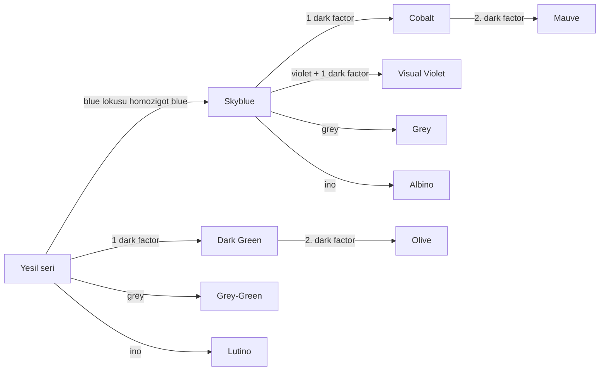
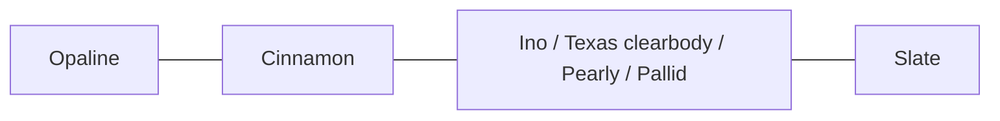

# Muhabbet Kusu Genetik Rehberi

Arastirma tarihi: 8 Nisan 2026

Bu belge, muhabbet kusu renk genetiklerini ve mutasyonlarini tek yerde toplamak icin hazirlandi. Hedef, "hangi genetik hangi genetikle eslesirse ne cikar" sorusunu ezber listesi yerine kuralli bir sistemle cevaplamaktir.

## Kapsam

- Bu rehber, projede desteklenen mutasyonlarin tamamini listeler.
- Tum olasi coklu kombinasyonlari tek tek enumerasyon yapmaz; bunun yerine kalitim tipi, lokus mantigi ve sik kombinasyonlari verir.
- Birden fazla bagimsiz lokus ayni yavruda yer aliyorsa, tek lokus olasiliklari carpilarak toplam olasilik hesaplanir.
- Z kromozomundaki yakin genlerde crossing-over gorulebildigi icin teorik oranlarla pratik sonuclar arasinda kucuk farklar olabilir. Bu durum en cok `opaline`, `cinnamon`, `ino` ve `slate` icin onemlidir. [K6] [K12]

## Hizli Sozluk

- `visual`: Kus mutasyonu gorunur olarak tasir.
- `split` veya `carrier`: Kus mutasyonu fenotipte gostermeden tasir.
- `AR`: Otozomal resesif.
- `AD`: Otozomal dominant.
- `AID`: Otozomal eksik dominant / tek faktor-cift faktor ayrimi olan mutasyon.
- `SLR`: Cinsiyete bagli resesif.
- `SF`: Single factor, tek faktor.
- `DF`: Double factor, cift faktor.

## Genetik Harita

WBO renk standartlarinda temel tonlar `Light Green`, `Dark Green`, `Olive Green`, `Grey Green`, `Skyblue`, `Cobalt`, `Mauve`, `Violet` ve `Grey` olarak verilir. [K1] [K2]

## Temel Kalitim Kurallari

### 1. Otozomal resesif mutasyonlar

Bu kurali `blue`, `dilute`, `greywing`, `clearwing`, `recessive_pied`, `clearflight_pied`, `fallow` tipleri, `saddleback`, `faded`, `mottled` ve benzeri mutasyonlarda kullanirsiniz.

| Eslesme | Sonuc |
| --- | --- |
| visual x visual | `%100 visual` |
| visual x split | `%50 visual`, `%50 split` |
| visual x normal | `%100 split` |
| split x split | `%25 visual`, `%50 split`, `%25 normal` |
| split x normal | `%50 split`, `%50 normal` |
| normal x normal | `%100 normal` |

### 2. Otozomal dominant mutasyonlar

Bu kurali `grey`, `dominant_pied`, `dominant_clearbody`, `crested` ve bazi tartismali modern mutasyonlarda kullanirsiniz.

| Eslesme | Sonuc |
| --- | --- |
| mutant x normal | Yaklasik `%50 mutant`, `%50 normal` |
| mutant x mutant | Yaklasik `%75 mutant`, `%25 normal` |

Not: Dominant mutasyonlarda heterozigot ve homozigot bireyler bazen ayni gorunmez. `crested` ve bazi ala tiplerinde saglik/ifade farklari onemlidir. [K10]

### 3. Otozomal eksik dominant mutasyonlar

Bu kurali `dark_factor`, `violet`, `spangle`, `anthracite` ve mavi-lokusundaki bazi yuz allellerinde kullanirsiniz.

| Eslesme | Sonuc |
| --- | --- |
| SF x normal | `%50 SF`, `%50 normal` |
| SF x SF | `%25 DF`, `%50 SF`, `%25 normal` |
| DF x normal | `%100 SF` |
| DF x SF | `%50 DF`, `%50 SF` |
| DF x DF | `%100 DF` |

### 4. Cinsiyete bagli resesif mutasyonlar

Muhabbet kusunda erkek `ZZ`, disi `ZW` kabul edilir. Disi kuslar `split` olamaz; mutant alleli alirlarsa gorunur olurlar.

Bu kurali `ino`, `pallid`, `opaline`, `cinnamon`, `slate`, `texas_clearbody` ve benzeri Z bagli mutasyonlarda kullanirsiniz.

| Eslesme | Erkek yavrular | Disi yavrular |
| --- | --- | --- |
| `erkek visual x disi normal` | `%100 split` | `%100 visual` |
| `erkek split x disi normal` | `%50 split`, `%50 normal` | `%50 visual`, `%50 normal` |
| `erkek normal x disi visual` | `%100 split` | `%100 normal` |
| `erkek visual x disi visual` | `%100 visual` | `%100 visual` |
| `erkek split x disi visual` | `%50 visual`, `%50 split` | `%50 visual`, `%50 normal` |

## Z Kromozomu ve Crossing-Over

MUTAVI kaynaklarina gore yaklasik crossing-over degerleri:

- `opaline <-> cinnamon`: yaklasik `%32` [K6]
- `opaline <-> slate`: yaklasik `%40.5` [K6]
- `cinnamon <-> slate`: yaklasik `%5 veya daha az` [K6] [K11]
- `cinnamon <-> ino`: yaklasik `%3` [K12]

Bu, ozellikle `lacewing`, `opaline-cinnamon`, `cinnamon-slate` ve `opaline-slate` eslesmelerinde beklenmeyen ama biyolojik olarak aciklanabilir yavrular cikabilecegi anlamina gelir. [K6] [K12]

## Ayni Lokusta Calisan Ozel Seriler

### 1. Blue lokusu

Mavi seri ve sariya/yuze etki eden bircok varyasyon ayni lokusta ele alinir. MUTAVI yazilarinda ve proje modelinde isimler kismen farkli olabilir. [K3] [K4]

| Allel / kombinasyon | Tipik fenotip |
| --- | --- |
| `bl+/bl+` | Yesil seri |
| `blue/blue` | Mavi seri |
| `yellowface_type1 + blue` | Yellowface Type I Blue |
| `yellowface_type2 + blue` | Yellowface Type II Blue |
| `goldenface + blue` | Goldenface Blue |
| `aqua + blue` | Aqua Blue |
| `turquoise + blue` | Turquoise Blue |
| `aqua + turquoise` | Turquoise Aqua |

Sik eslesme ornekleri:

| Eslesme | Sonuc |
| --- | --- |
| Blue x Blue | `%100 Blue` |
| Blue x Green split Blue | `%50 Blue`, `%50 Green split Blue` |
| Green split Blue x Green split Blue | `%25 Blue`, `%50 Green split Blue`, `%25 Green` |
| YF2 Blue x Blue | `%50 YF2 Blue`, `%50 Blue` |
| Goldenface Blue x Blue | `%50 Goldenface Blue`, `%50 Blue` |
| Aqua Blue x Turquoise Blue | `%25 Aqua Blue`, `%50 Turquoise/Aqua`, `%25 Turquoise Blue` |

Notlar:

- `Yellowface Type I` cift faktor mavi seride beyaz yuzlu gibi gorunebilir. Bu, standartlar arasinda isim farki yaratan alanlardan biridir. [K4]
- `Goldenface`, `Aqua`, `Turquoise`, `Blue Factor I/II` icin avicultur standardizasyonu kaynaga gore degisebilir; bu nedenle ayni lokusta olduklarini bilmek, isim ezberlemekten daha guvenlidir. [K3] [K4]

### 2. Dilution lokusu

`greywing`, `clearwing` ve `dilute` ayni lokusun allelleridir. En onemli pratik sonuc, `greywing + clearwing` kombinasyonunun `Full-Body Greywing` vermesidir. [K5]

| Eslesme / kombinasyon | Sonuc |
| --- | --- |
| `greywing/greywing` | Greywing |
| `clearwing/clearwing` | Clearwing |
| `dilute/dilute` | Dilute |
| `greywing/clearwing` | Full-Body Greywing |
| `greywing/dilute` | Greywing, dilute tasiyici |
| `clearwing/dilute` | Clearwing, dilute tasiyici |

Sik eslesme ornekleri:

| Eslesme | Sonuc |
| --- | --- |
| Greywing x Clearwing | `%100 Full-Body Greywing` |
| Greywing x Dilute | `%100 Greywing / dilute` |
| Clearwing x Dilute | `%100 Clearwing / dilute` |
| Greywing split Dilute x Greywing split Dilute | Greywing agirlikli sonuc verir; `%25 dilute` cikabilir |

### 3. Ino lokusu

`ino`, `texas_clearbody`, `pearly` ve aviculture yorumlarinda `pallid` ayni gen ailesiyle iliskili ele alinir. MUTAVI, sex-linked clearbody'yi `ino` lokusunun bir alleli olarak tartisir. [K7]

Pratik kombinasyonlar:

| Kombinasyon | Tipik ad |
| --- | --- |
| Ino + Green series | Lutino |
| Ino + Blue series | Albino |
| Cinnamon + Ino | Lacewing |
| Pallid + Ino | PallidIno / lacewing-benzeri acik fenotip |
| Texas Clearbody + Ino | Texas Clearbody gorunur, ino tasiyabilir |
| Texas Clearbody + Pallid | Pallid Texas Clearbody |

## En Sik Birlesik Fenotipler

| Genetik kombinasyon | Ortaya cikan fenotip |
| --- | --- |
| `blue + ino` | Albino |
| `yesil seri + ino` | Lutino |
| `cinnamon + ino` | Lacewing |
| `greywing + clearwing` | Full-Body Greywing |
| `recessive_pied + dutch_pied/continental clearflight tipi` | Dark-Eyed Clear |
| `yellowface/goldenface + blue + ino` | Creamino benzeri fenotipler |
| `violet + blue + 1 dark factor` | Visual Violet |

`Dark-Eyed Clear` konusunda MUTAVI acik bicimde `recessive pied + Dutch/continental clearflight` birlikteligini vurgular; `recessive pied + Australian dominant pied` ayni sonucu vermez. [K8]

## Mutasyon Katalogu

Asagidaki tablolar, projede desteklenen mutasyonlarin tamamini kapsar. `Eslesme notu` sutunu, hangi genel kuralla hesap yapacaginizi soyler.

### A. Temel seri, yuz ve ton mutasyonlari

| Mutasyon | Kalitim | Tipik renk / gorunum | Eslesme notu | Ana kaynak |
| --- | --- | --- | --- | --- |
| Blue | AR | Yesil seriyi mavi seriye cevirir; sari pigment kalkar | AR tablosu, Blue lokusu | [K1] [K3] |
| Yellowface Type I | AID | Mavi kuslarda sari maske; bazi cift faktor kuslarda beyaz yuz paradoksu | Blue lokusu | [K3] [K4] |
| Yellowface Type II | AID | Sari maske ve bazen govdeye sari yayilim | Blue lokusu | [K3] [K4] |
| Goldenface | AID | Yuzde daha kuvvetli altin sari; mavi seride yogun sari yayilim | Blue lokusu | [K3] [K4] |
| Aqua | AID | Mavi-seri tonu aqua / deniz yesili yonune kayar | Blue lokusu | [K3] |
| Turquoise | AID | Mavi-seri tonu daha zengin turkuaz gorunur | Blue lokusu | [K3] |
| Blue Factor I | AID | Hafif yesilimsi / ara mavi seri ifadesi | Blue lokusu | [K3] |
| Blue Factor II | AID | Blue Factor I'e gore daha guclu ara mavi ifade | Blue lokusu | [K3] |
| Dark Factor | AID | Yesilde `Light -> Dark -> Olive`, mavide `Skyblue -> Cobalt -> Mauve` | AID tablosu | [K1] |
| Violet | AID | Ozellikle mavi seride morumsu ton; 1 dark factor ile cok belirgin | AID tablosu | [K1] [K3] |
| Grey | AD | Yesilde grey-green, mavide grey | AD tablosu | [K1] [K3] |
| Anthracite | AID | Ozellikle mavi seride cok koyu kozmursu ton | AID tablosu | [K3] [K14] |

### B. Dilution ve melanin modifikatorleri

| Mutasyon | Kalitim | Tipik renk / gorunum | Eslesme notu | Ana kaynak |
| --- | --- | --- | --- | --- |
| Dilute | AR | Melanin ciddi azalir; kus genel olarak daha acik gorunur | AR tablosu, dilution lokusu | [K5] |
| Greywing | AR | Kanat cizgileri gri, govde rengi yari seyreltik | AR tablosu, dilution lokusu | [K1] [K5] |
| Clearwing | AR | Kanatlar acilir, govde rengi parlak kalir | AR tablosu, dilution lokusu | [K1] [K5] |
| Cinnamon | SLR | Siyah melanin kahverengiye doner; daha sicak ton | SLR tablosu | [K1] [K3] |
| Slate | SLR | Mavi seride donuk mavi-gri / arduvaz tonu, yanak lekesi mat koyu olur | SLR tablosu | [K3] [K11] |
| Blackface | Tartismali | Yuz ve govdede melanin genisler, maske koyulasir | Kaynaklar farkli; tartismali | [K3] [K9] |
| Faded | AR | Yikanmis, soluk gorunum; kanat izleri zayiflar | AR tablosu | [K3] |
| Fallow (English) | AR | Kirmizi / plum goz, sicak acik govde tonu | AR tablosu | [K1] [K3] |
| Fallow (German) | AR | English fallow'a benzer ama ayrik lokus olarak anlatilir | AR tablosu | [K3] |
| Fallow (Scottish) | AR | Bronzumsu isaretler ve kirmizi goz | AR tablosu | [K3] |
| Pallid | SLR | Melanin azalir ama tam ino kadar silinmez; yumusak cizgili acik kus | SLR tablosu, ino ailesi | [K3] |
| Ino | SLR | Yesil seride Lutino, mavi seride Albino | SLR tablosu, ino ailesi | [K1] [K3] [K7] |

### C. Desen, ala ve clearbody mutasyonlari

| Mutasyon | Kalitim | Tipik renk / gorunum | Eslesme notu | Ana kaynak |
| --- | --- | --- | --- | --- |
| Opaline | SLR | Bas ve kanat barring azalir, sirtta V benzeri desen olur | SLR tablosu | [K1] [K3] |
| Spangle | AID | Tek faktorde ters kanat deseni; cift faktorde neredeyse duz sari/beyaz | AID tablosu | [K1] [K3] |
| Recessive Pied | AR | Rastgele acik lekeler; goz halkasi davranisi farkli olabilir | AR tablosu | [K1] [K8] |
| Dominant Pied (Australian) | AD | Govdede temiz acik bantlar / ala alanlar | AD tablosu | [K1] [K3] |
| Clearflight Pied | AR veya tartismali standart | Ucus telekleri ve kuyrukta aciklik, kucuk bas lekesi | Kaynaga gore degisebilir | [K1] [K8] |
| Dutch Pied | AD veya AID tartismali | Irreguler ala desen; bazi hatlarda clearflight benzeri secilim | Kaynak farki var | [K1] [K3] [K8] |
| Saddleback | AR | Sirtta temiz eyer / V benzeri alan, bas barringi farkli | AR tablosu | [K1] [K3] |
| Mottled | Tartismali | Tuyu degistikce artan acik alanlar, ilerleyici ala gorunum | Kaynaklar farkli | [K3] |
| Pearly | SLR | Kanat isaretlerinde inci / perli kenarlanma | SLR tablosu, ino ailesi | [K3] [K7] |
| Texas Clearbody | SLR | Govde melanin azalir, kanat cizgileri koyu kalir | SLR tablosu, ino ailesi | [K1] [K7] |
| Dominant Clearbody | AD | Govde daha temiz ve acik, kanatlar daha koyu kalabilir | AD tablosu | [K3] [K7] |

### D. Tuyu yapisi ve saglikla ilgili ozel durumlar

| Mutasyon | Kalitim | Tipik gorunum | Eslesme notu | Ana kaynak |
| --- | --- | --- | --- | --- |
| Crested (Tufted) | AD | Tepede tek veya kume halinde tepe | AD tablosu; crest x crest riskli | [K3] [K10] |
| Crested (Half-Circular) | AD | Yarim daire tepe | AD tablosu; crest x crest riskli | [K3] [K10] |
| Crested (Full-Circular) | AD | Tam daire corona tepe | AD tablosu; crest x crest riskli | [K3] [K10] |
| Feather Duster | AR, patolojik | Asiri uzayan, surekli buyuyen tuyler; ucus ve beslenme sorunu | Eslesmeden kacinilacak durum | [K15] |

## Cok Sorulan Eslesmeler

### Blue ile Green split Blue

- `Blue x Green split Blue`
- Sonuc: `%50 Blue`, `%50 Green split Blue`

### Cinnamon ile normal disi

- `erkek Cinnamon visual x disi normal`
- Erkek yavrular: `%100 split cinnamon`
- Disi yavrular: `%100 cinnamon`

### Ino ile normal disi

- `erkek Ino visual x disi normal`
- Erkek yavrular: `%100 split ino`
- Disi yavrular: `%100 ino`

### Greywing ile Clearwing

- Iki ebeveyn ilgili lokusta saf ise `Greywing x Clearwing = %100 Full-Body Greywing` [K5]

### Recessive Pied ile Dutch Pied

- `Recessive Pied x Dutch Pied / clearflight tipi`
- Bazi yavrularda `Dark-Eyed Clear` hattina giden kombinasyonlar olusabilir. [K8]

### Cinnamon ile Ino

- Saf kalitim mantigi `Lacewing` fenotipine gider.
- Ancak `cinnamon` ve `ino` Z kromozomunda birbirine yakin oldugu icin nadir crossing-over sonucu beklenmeyen `ino`, `cinnamon` veya ara formlar da gorulebilir. [K6] [K12]

## Riskli ve Tartismali Alanlar

### 1. Crest x crest

MUTAVI'nin derledigi calismalarda crest faktorunun subvital oldugu, embriyo kayiplari ve norolojik sorunlarla iliskili olabildigi belirtilir. Uygulamada `crest x crest` eslesmesi temkinle ele alinmalidir. [K10]

### 2. Blackface siniflandirmasi

Bu, en net tartisma alanlarindan biridir:

- MUTAVI 2007 makalesi `blackface` icin `otosomal resesif` der. [K9]
- Projedeki mevcut mutasyon modeli `dominant` yorumunu kullanir.

Bu rehberde `blackface`, tartismali olarak isaretlenmistir; ciftlestirme plani yaparken kendi damizlik hattinizdaki fiili sonuclari kayit altina almak gerekir.

### 3. Dutch Pied ve Clearflight iliskisi

MUTAVI, Dutch pied ile continental clearflight arasinda secilimsel iliski olabilecegini tartisir. Buna karsilik modern veri tabanlarinda bunlar bazen ayri mutasyonlar gibi modellenir. [K8]

### 4. Mottled

MUTAVI revize gen listesinde `mottle` icin `polygenic` ifadesi gorulur; uygulamadaki veri modeli ise bunu tek mutasyon gibi ele alabilir. [K3]

### 5. Yellowface adlandirmasi

`Yellowface Type I`, `Type II`, `Goldenface`, `Aqua`, `Turquoise`, `Blue Factor I/II` isimleri kaynaklar ve ulke gelenekleri arasinda tam bire bir degil. Burada lokus mantigi, sabit isimden daha onemlidir. [K3] [K4]

## Gorsel Referans Bankasi

- WBO Colour Standards: temel renkler ve resmi show varyeteleri icin ana referans. [K1]
- WBO Pictorial Standard PDF: tek sayfada gorsel standart ozeti. [K2]
- MUTAVI makaleleri: kalitim mantigi, allel serileri ve tarihsel test eslesmeleri icin ana referanslar. [K4] [K5] [K6] [K7] [K8] [K9] [K10] [K11] [K12]

## Sonuc

Muhabbet kusu genetiginde en kritik nokta, her mutasyonu tek tek ezberlemekten cok su dort soruyu sormaktir:

1. Bu mutasyon `AR`, `AD`, `AID` ya da `SLR` mi?
2. Bu mutasyon bagimsiz mi, yoksa `blue`, `dilution` ya da `ino` gibi ayni lokusun alleli mi?
3. Disi mi erkek mi tasiyor?
4. Bu mutasyon baska bir mutasyonla birlesince yeni bir isimli fenotip veriyor mu?

Bu dort soruya cevap verdiginizde, yavru olasiliklarinin buyuk cogunlugunu dogru hesaplarsiniz.

## Kaynaklar

- [K1] WBO Colour Standards, resmi renk ve varyete standardi: [https://www.world-budgerigar.org/colourstds.htm](https://www.world-budgerigar.org/colourstds.htm)
- [K2] WBO Colour Budgerigar Pictorial Standard PDF: [https://www.world-budgerigar.org/photos15/WBO%20Standard%20for%20Colour%20Budgerigar%20Pictorial%20Ideal.pdf](https://www.world-budgerigar.org/photos15/WBO%20Standard%20for%20Colour%20Budgerigar%20Pictorial%20Ideal.pdf)
- [K3] MUTAVI, Revised List of Mutant Genes of the Budgerigar: [https://www.mutavi.info/index.php?art=symbols](https://www.mutavi.info/index.php?art=symbols)
- [K4] MUTAVI, Gene function in Yellowface Budgerigars: [https://www.mutavi.info/index.php?art=yellowface](https://www.mutavi.info/index.php?art=yellowface)
- [K5] MUTAVI, Phenotypic Effects Caused by the Multiple Allele Series of the dil-locus: [https://www.mutavi.info/index.php?art=dilute](https://www.mutavi.info/index.php?art=dilute)
- [K6] MUTAVI, Crossing-over in the Sex-chromosome of the Male Budgerigar: [https://www.mutavi.info/index.php?art=sexchrom](https://www.mutavi.info/index.php?art=sexchrom)
- [K7] MUTAVI, Genotypic and Phenotypic Aspects of the Sex-Linked clearbody: [https://www.mutavi.info/index.php?art=clearbod](https://www.mutavi.info/index.php?art=clearbod)
- [K8] MUTAVI, Recessive Pied in the Origin of Dark Eyed Clears: [https://www.mutavi.info/index.php?art=blackeye](https://www.mutavi.info/index.php?art=blackeye)
- [K9] MUTAVI, Blackface: a new mutation in the budgerigar: [https://www.mutavi.info/index.php?art=blackfa](https://www.mutavi.info/index.php?art=blackfa)
- [K10] MUTAVI, Crest: A Subvital Character in the Budgerigar: [https://www.mutavi.info/index.php?art=crested](https://www.mutavi.info/index.php?art=crested)
- [K11] MUTAVI, Description of the Slate Budgerigar: [https://www.mutavi.info/index.php?art=slate](https://www.mutavi.info/index.php?art=slate)
- [K12] MUTAVI, The lacewing: An Enigma in Budgerigar Breeding?: [https://www.mutavi.info/index.php?art=lacewing](https://www.mutavi.info/index.php?art=lacewing)
- [K13] WBO, Recognition of New Mutations: [https://world-budgerigar.org/recomutations.htm](https://world-budgerigar.org/recomutations.htm)
- [K14] WBO Noticeboard 2011, Anthracite'in taninmasi notu: [https://www.world-budgerigar.org/noticeboard11.htm](https://www.world-budgerigar.org/noticeboard11.htm)
- [K15] OMIA, Feather, abnormal growth in budgerigar: [https://omia.org/OMIA002106/13146/](https://omia.org/OMIA002106/13146/)
